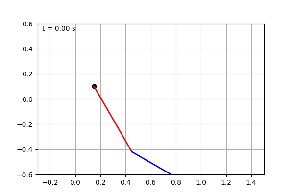

<h1>System Dynamics Final Project</h1>

<strong>Author:</strong> Juseong Kim (김주성) – Mechanical Engineering, Kyung Hee University

<!-- Pendulum simulation (animated GIF) -->
<figure style="text-align:center; margin: 1.5rem 0;">
  
  <figcaption style="font-size:0.9rem; color:#555;">
    Figure&nbsp;1. Time-lapse simulation of the three-link pendulum (X₂ slider highlighted).
  </figcaption>
</figure>

<h2>1. Overview</h2>

This project analyses a planar three‑link pendulum using <em>constraint‑based multibody dynamics</em>.  The notebook:

<ul>
<li>Derives the equations of motion (EoMs) symbolically.</li>
<li>Integrates the system with <code>solve_ivp</code> (RK45) for two different time‑step settings: <strong>1000&nbsp;steps</strong> (&Delta;t&nbsp;=&nbsp;1&nbsp;ms) and <strong>3000&nbsp;steps</strong> (&Delta;t&nbsp;=&nbsp;0.333&nbsp;ms).</li>
<li>Compares the X2 slider displacement against pre‑computed CSV references (<code>pendulum_data.csv</code>, <code>pendulum_data_embedded.csv</code>, <code>pendulum_data3000.csv</code>).</li>
</ul>

<h2>2. Data Description</h2>
<table>
<thead><tr><th>File</th><th>Columns</th><th>Description</th></tr></thead>
<tbody>
<tr><td><code>pendulum_data.csv</code></td><td>t, X2, θ3, θ4, …</td><td>Baseline solution (1000 steps)</td></tr>
<tr><td><code>pendulum_data_embedded.csv</code></td><td>t, X2, θ3, θ4, …</td><td>Embedded method solution (1000 steps)</td></tr>
<tr><td><code>pendulum_data3000.csv</code></td><td>t, X2, θ3, θ4, …</td><td>Fine‑step solution (3000 steps)</td></tr>
</tbody>
</table>

<h2>3. additional</h2>

The license for this project problem rests with a mechanical engineering professor at Kyung Hee University

